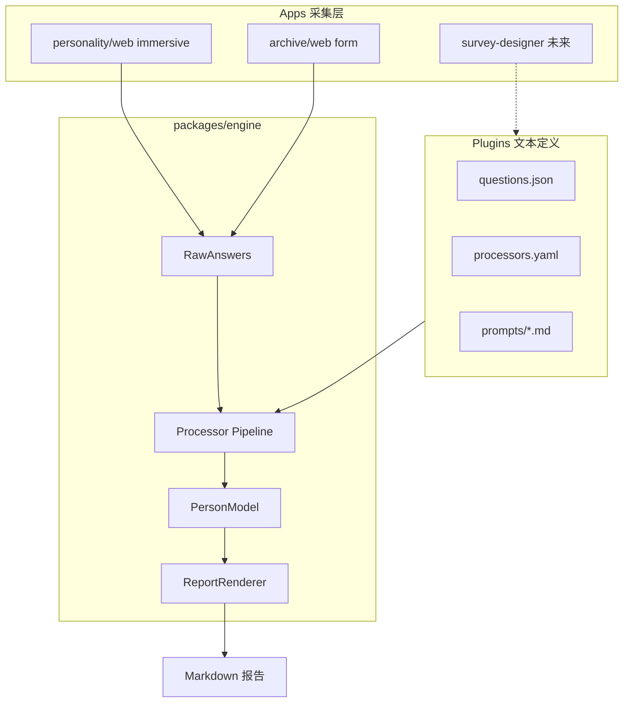
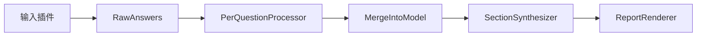
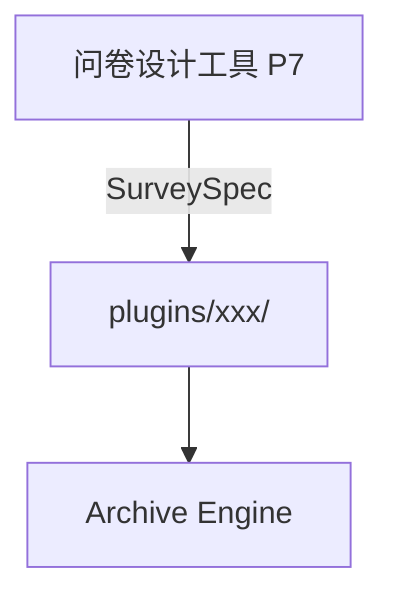

# 人的档案引擎（Person Archive Engine）

> 本仓库架构的单源真相。报告渲染细节见 [archive-report-spec.md](./archive-report-spec.md)；人格深潜 UI 见 [design-system.md](./design-system.md)。

---

## 摘要

我们要构建的不是「问完把答案贴进 Markdown 的表单」，而是 **Person Archive Engine**：

```text
原始表达 → 分题处理 → 统一档案模型 → 分块报告
```

**核心原则（来自产品评审，见 [gpt.md](../gpt.md)）**：

> **档案是关于人的，而不是关于问题的。**

问卷、人格深潜、未来的专业/娱乐探测，都是**输入插件**。问卷设计工具是**生产插件的上游工厂**（P7，暂后）。引擎本身与插件的实现本质都是**文本**（JSON / YAML / Markdown / 提示词），因此体系可触及，但需要按正确顺序搭建。

---

## 1. 我们在考虑什么 / 希望得到什么

### 1.1 三层诉求

| 层次 | 问题 | 期望产出 |
| --- | --- | --- |
| **档案本体** | 这个人是谁？ | 长期可更新、分客观/人格存储、阅读时像认识一个人的 **PersonModel** |
| **采集管道** | 信息从哪来？ | 整页表单、人格深潜、专业问卷等 — 全是**输入插件** |
| **表达视图** | 怎么给人看？ | 详细模式报告（MD 先行，以后 HTML/PDF）；简略模式以后再做 |

### 1.2 我们不想得到什么

P0 实现的路径：

```text
问题 → 回答 → 直接写入报告
```

产出的是**问卷记录**（Q1/A1、Q2/A2），不是**人物档案**。哪怕 UI 再精美，只要报告在展示回答而不是在展示这个人，体验就是错的。

**反例与正例**（职业题）：

用户回答：

> 我是一名前端工程师，最近在考虑往产品方向发展，但还没有完全决定。

| 错误（P0） | 正确（目标） |
| --- | --- |
| 职业：我是一名前端工程师，最近在考虑… | **职业发展** — 当前从事前端开发工作。近阶段开始关注产品设计与需求分析方向，处于探索职业拓展可能性的阶段。 |

后者是 **AI 理解后形成的档案语言**，不是原话粘贴。

### 1.3 设计优先级（重要）

在 PersonModel、Processor、插件协议之前，必须先稳定 **「理想的人物档案长什么样」**。推荐顺序：

```text
① 理想的人物档案目录（阅读体验）
   ↓
② 档案有哪些核心部分（报告章节）
   ↓
③ 每部分需要什么信息（Model 字段）
   ↓
④ 用什么问题收集（插件 / 题库）
   ↓
⑤ 如何处理回答（Processor）
   ↓
⑥ 如何生成报告（Renderer）
   ↓
⑦ 如何设计更多问卷（问卷设计工具）
```

不要从 ⑦ 往回推。档案结构未定之前，设计再多问卷，都会回到「问到了，然后呢？」

---

## 2. 理想的人物档案（详细模式）

### 2.1 第一次打开时应看到什么

以下目录描述**阅读体验**（不是内部存储分区）。读者应感觉在**认识一个人**，而不是在读「客观卷」和「人格卷」。

```markdown
# 个人档案

## 概览
一句话认识这个人（AI 合成，非字段拼接）

## 当前人生状态
最近在经历什么、处于什么阶段

## 生活环境
工作、居住、家庭与社交环境（客观事实 + 自然叙述）

## 能力与经验
擅长什么、职业背景、技能方向

## 价值观与追求
在意什么、近期什么最重要

## 关系与相处
如何与人建立关系、社交圈特征

## 决策方式
面对选择时的倾向

## 情绪与压力
压力来源与恢复方式（有人格深潜数据时 richer）

## 综合观察
这个人整体给人的感觉（跨层 AI 综合）
```

### 2.2 存储 vs 阅读

**内部存储**仍分 `objective` 与 `personality`（便于处理与插件挂载），但**报告不按「客观档案 / 人格档案」分章**。

示例（同一段读起来是同一个人）：

> 当前在互联网行业工作五年。  
> 相比于职位晋升，更关注创造和表达的自由度。

第一句来自客观层，第二句来自人格层 — 渲染时可归入「当前人生状态 + 价值观与追求」的连贯段落，而非两张表。

### 2.3 详细模式 vs 简略模式

| 模式 | 状态 | 说明 |
| --- | --- | --- |
| **详细** | P3+ 目标 | [archive-catalog-v1.md](../archive-catalog-v1.md) §0–§13 全部展开；**人的详尽档案唯一本体** |
| **简略** | 未设计 | 从同一份 PersonModel **选取** 呈现（章节加权、条目的摘要或省略）；**不另建更短目录** |
| **专项** | 插件 | 技能、收入等独立问卷 → `modules.*`，挂载 §9 等条，不替代核心建档卷 |

---

## 3. 核心架构

### 3.1 总览



### 3.2 PersonModel（统一档案模型）

```text
PersonModel
├── meta          # id, completeness, mode, updatedAt
├── objective     # 事实层：规范化字段 + 转写段落
├── personality   # 人格层：观察结论，非 raw 原话列表
├── modules       # 插件槽：personalityDive, skillSurvey, ...
└── audit         # 可选：原始回答追溯（附录，不进正文）
```

**原则**：

- 报告 **只读 Model**，不读 raw answers
- 简单客观字段经 **normalize** 写入 objective
- 复杂回答经 **ai_extract** 写入 objective / personality
- 跨题/跨模块经 **ai_synthesize** 写入 personality 或综合节
- raw answers 仅 audit / 附录

### 3.3 Processor Pipeline（分题处理）

每题配置（未来在 `plugins/*/processors.yaml`）：

```yaml
id: career-main
layer: objective              # objective | personality
processor: ai_extract         # normalize | ai_extract | ai_synthesize
mapsTo: objective.career
options: [...]                # 锚点选项
allowFreeText: true           # 选项 + 补充输入框（默认题型）
promptRef: prompts/career-extract.md
```

| Processor | 输入 | 输出 | AI |
| --- | --- | --- | --- |
| `normalize` | 选项 / 短文本 | 枚举、格式、单位 | 否 |
| `ai_extract` | 选项 + 自由文本 | 结构化字段 + 档案语言段落 | 是 |
| `ai_synthesize` | 多题 / 模块 snapshot | 观察结论、综合段落 | 是 |



### 3.4 为何本质是「文本体系」

| 文本类型 | 示例 | 职责 |
| --- | --- | --- |
| 定义文本 | `questions.json`, `processors.yaml`, `module.json` | 采什么、怎么处理 |
| 提示词 | `prompts/*.md` | AI 转写与综合 |
| 输入文本 | 用户选项 + 自由输入 | 原始表达 |
| 中间文本 | Processor 输出的 JSON + narrative | 档案语言 |
| 输出文本 | 报告 `.md` | 给人读 |

体系「可触及但混乱」的原因：若跳过中间层，就会误以为改 JSON 题库就等于做了档案。**插件改的是输入；引擎改的是理解。**

---

## 4. 输入插件体系

### 4.1 插件 = 一个目录（全是文本）

```text
plugins/core-intake/
├── module.json           # id, name, uiExperience: form
├── questions.json        # 选项 + allowFreeText
├── processors.yaml       # 每题 processor
└── prompts/              # AI 提示词（可后填）
```

### 4.2 插件类型

| 类型 | UI 体验 | 说明 | 现状 |
| --- | --- | --- | --- |
| **core-intake** | `form` 整页表单 | 通用档案采集，测试基座 | P0 archive-web（待改整页） |
| **personality-dive** | `immersive` 逐题氛围 | 人格探索，15 维 + AI 报告 | apps/web + apps/api |
| **specialized-survey** | `form` / `compact` | 收入、技能、娱乐等 | 未来 |
| **external-import** | — | JSON 手动导入 | 预留 |

### 4.3 与人格深潜的关系

- 人格深潜是 **personality 层** 的输入插件，不是档案的全部
- 氛围 UI（粒子、音频、逐题）**仅用于 immersive 类**，不用于客观表单
- 完成后导出 `SessionSnapshot` → `PersonModel.modules.personalityDive` → 经 synthesize 汇入「决策方式 / 情绪与压力 / 综合观察」等章节

### 4.4 问卷设计工具（P7，边界先定）

**定位**：插件工厂 — 通过对话明确需求（如「Java 水平问卷」「收入区间」），产出标准 `plugins/xxx/` 目录 + 提示词草稿，人审后启用。

**现在不做**。档案目录与 Processor 协议未稳定前，设计工具只会制造更多「问到了然后呢」的问卷。



---

## 5. 采集 UI：多体验族

| 体验族 | 适用 | 交互 |
| --- | --- | --- |
| `immersive` | 人格探索 | 逐题、深空氛围、非评判语气 |
| `form` | 客观 / 混合采集 | **整页铺开**、每题「选项 + 输入框」、可跳过 |
| `compact` | 专业短问卷 | 单页分段、工具感 |

**档案采集**：archive-web 已改为整页 FormPage（`/form`），作为 form 类插件测试基座。

---

## 6. 与 P0 实现的差距

| 项目 | P0 现状 | 目标 |
| --- | --- | --- |
| 数据流 | answers 直 mapsTo → 报告 | answers → Processor → PersonModel → 报告 |
| 报告语气 | 原话 / 表格粘贴 | 档案语言 + 自然叙述 |
| 章节 | 客观表 + 原话列表 | 理想目录（§2.1） |
| 题型 | 选择 **或** 文本 | 选项 **+** 自由输入 |
| 存储 | 纯前端 localStorage | P5 起 archive-api + SQLite |

**废弃路径**（P2 后逐步删除）：

- [`packages/engine/src/mapAnswers.ts`](../packages/engine/src/mapAnswers.ts) 直写即报告
- [`archive-report-spec.md`](./archive-report-spec.md) 中「原始自述列表」作为正文的设计

**可复用**：monorepo 独立 app、Zustand 持久化、MD 下载、插件独立端口 5174。

---

## 7. 分阶段路线

| 阶段 | 内容 | 状态 |
| --- | --- | --- |
| **P0** | archive 独立目录、MD 输出、验证路径 | 已完成 |
| **P1** | 本文档 + README 重写 + report-spec 废弃标注 | 进行中 |
| **P2** | monorepo 大规模重构（§8） | 已完成 |
| **P3** | `packages/engine` 骨架：Model + Processor 接口 + stub AI | 待执行 |
| **P4** | archive 整页 FormPage + normalize / ai_extract 接入 | 待执行 |
| **P5** | archive-api：持久化 + LLM 管道 | 待执行 |
| **P6** | personality-dive export → modules 槽 | 待执行 |
| **P7** | survey-designer 问卷设计工具 | 待执行 |

---

## 8. Monorepo 重构（P2 执行清单）

### 8.1 工程原则

1. **产品域分层**：`apps/{product}/{web|api}`
2. **库与产品分离**：`packages/` vs `apps/`
3. **插件即数据**：`plugins/` 不进 app 源码
4. **引擎单一出口**：PersonModel + Processor + Report 只在 `packages/engine`
5. **迁移保历史**：`git mv`，一产品域一 PR，每 PR 可独立 dev/build
6. **命名统一**：npm scope `@personal-archive/*`

### 8.2 目标目录树

```text
personal_archive/
├── .env.example              # 索引：指向各 app 的 .env.example
├── .gitignore
├── package.json              # name: personal-archive
├── pnpm-workspace.yaml
├── pnpm-lock.yaml
├── README.md
├── docs/
│   ├── person-archive-engine.md   # 本文档
│   ├── archive-report-spec.md     # 报告附录（待按 §2.1 修订）
│   └── design-system.md           # 人格 immersive UI（P2 可 rename 为 design-system-immersive.md）
├── packages/
│   ├── engine/               # PersonModel, Processor, ReportRenderer
│   ├── plugin-sdk/           # 插件协议 Zod + 加载器
│   └── personality/          # 原 packages/shared
├── plugins/
│   ├── core-intake/          # 原 archive-core/data + processors
│   └── personality-dive/     # 原 apps/api/data/questions
├── prompts/                  # 引擎级 synthesize 提示词
└── apps/
    ├── personality/
    │   ├── web/              # 原 apps/web
    │   └── api/              # 原 apps/api；含 .env.example
    ├── archive/
    │   ├── web/              # 原 apps/archive-web
    │   └── api/              # P5 新建
    └── survey-designer/      # P7
```

**pnpm-workspace.yaml**：

```yaml
packages:
  - "packages/*"
  - "apps/*/*"
  - "apps/survey-designer"
```

### 8.3 迁移映射表

| 现有路径 | 目标路径 |
| --- | --- |
| `apps/web` | `apps/personality/web` |
| `apps/api` | `apps/personality/api` |
| `apps/archive-web` | `apps/archive/web` |
| `packages/shared` | `packages/personality` |
| `packages/archive-core` | 拆入 `packages/engine` + `plugins/core-intake` |
| `apps/api/data/questions` | `plugins/personality-dive/` |
| 根 `.env.example` | 索引 + `apps/personality/api/.env.example` |

### 8.4 分 PR 策略

| PR | 内容 | 验收 |
| --- | --- | --- |
| PR-1 | `packages/personality` rename + 引用更新 | `pnpm dev` 人格深潜可跑 |
| PR-2 | `apps/personality/{web,api}` git mv + workspace | 同上 |
| PR-3 | `packages/engine` + `plugins/` + archive-core 迁入 | typecheck 通过 |
| PR-4 | `apps/archive/web` + FormPage | `pnpm dev:archive` 可跑 |
| PR-5 | README、package.json、.env 拆分、.gitignore | 新人只看 README 可启动 |

### 8.5 根目录文件处理

| 文件 | P2 动作 |
| --- | --- |
| **README.md** | 完全重写（P1 已按目标结构写，P2 同步路径） |
| **package.json** | `name` → `personal-archive`；scripts 见下 |
| **pnpm-workspace.yaml** | 更新 glob |
| **pnpm-lock.yaml** | 各 PR 末尾 `pnpm install`，不手改 |
| **.env.example** | 拆到 `apps/personality/api/.env.example`；根留复制指引 |
| **.env** | 不提交；开发者在新路径重建 |
| **.gitignore** | `**/data/*.db` 等，替换宽泛的 `data/` |

**目标 scripts**：

```json
{
  "dev:personality": "concurrently \"pnpm dev:personality:api\" \"pnpm dev:personality:web\"",
  "dev:personality:web": "pnpm --filter @personal-archive/personality-web dev",
  "dev:personality:api": "pnpm --filter @personal-archive/personality-api dev",
  "dev:archive": "pnpm --filter @personal-archive/archive-web dev",
  "dev": "pnpm dev:personality"
}
```

**包名迁移**：

| 现名 | 新名 |
| --- | --- |
| `@renge-shenqian/web` | `@personal-archive/personality-web` |
| `@renge-shenqian/api` | `@personal-archive/personality-api` |
| `@personal-archive/web` | `@personal-archive/archive-web` |
| `@renge-shenqian/shared` | `@personal-archive/personality` |
| `@personal-archive/core` | `@personal-archive/engine` |

### 8.6 重构约束

- **允许**大改目录、包名、import
- **不允许**改人格深潜运行时行为（路由、API、交互在 PR-1/2 后与现一致）
- archive FormPage 与 Processor 管道属 P4 预期产品改动

---

## 9. 外部评审要点（gpt.md 摘要）

完整原文见仓库根目录 [gpt.md](../gpt.md)。以下纳入本设计：

1. **档案是关于人的，不是关于问题的** — 全文第一原则
2. **先定理想档案目录，再定 Model / 问卷 / Processor** — §1.3 优先级
3. **客观/人格是存储分类，不是阅读分章** — §2.2
4. **问卷设计工具压后** — §4.4，排在 ⑦
5. **练习**：对熟悉的人（或自己）手写理想档案目录，稳定后再动技术 — 见 §2.1

---

## 10. 开放决策项

- [ ] PersonModel 各字段最终清单（由 §2.1 章节反推）
- [ ] 每题 `prompts/*.md` 具体内容
- [ ] archive-api 独立服务 vs 合并 personality-api
- [ ] 简略模式报告大纲
- [ ] `DATABASE_PATH` 放在 `apps/personality/api/data/` 还是仓库根 `data/`
- [ ] `design-system.md` 是否重命名为 `design-system-immersive.md`（P2）

---

## 相关文档

- [archive-catalog-v1.md](../archive-catalog-v1.md) — **理想人物档案目录 V1**（当前应优先对齐的正文结构）
- [docs/archive-catalog/meta-frame-moment.md](../docs/archive-catalog/meta-frame-moment.md) — Frame / Moment 语境层
- [archive-report-spec.md](./archive-report-spec.md) — P0 报告格式（部分将废弃）
- [design-system.md](./design-system.md) — 人格深潜 immersive UI
- [gpt.md](../gpt.md) — 产品评审与优先级建议
